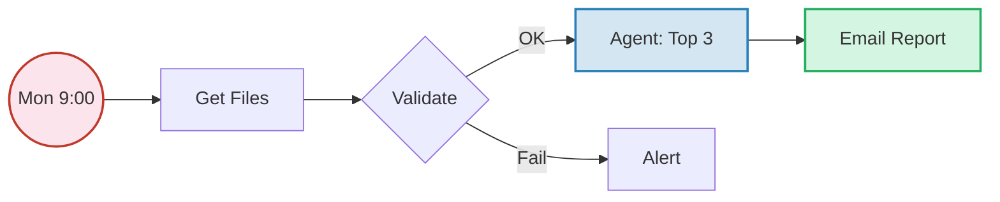
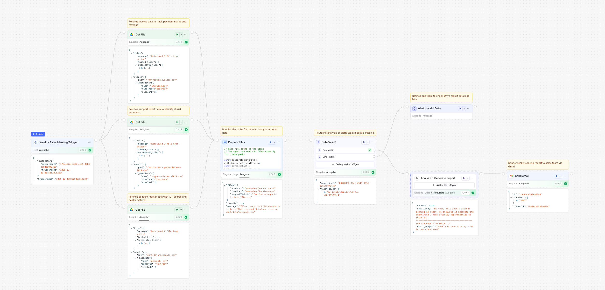
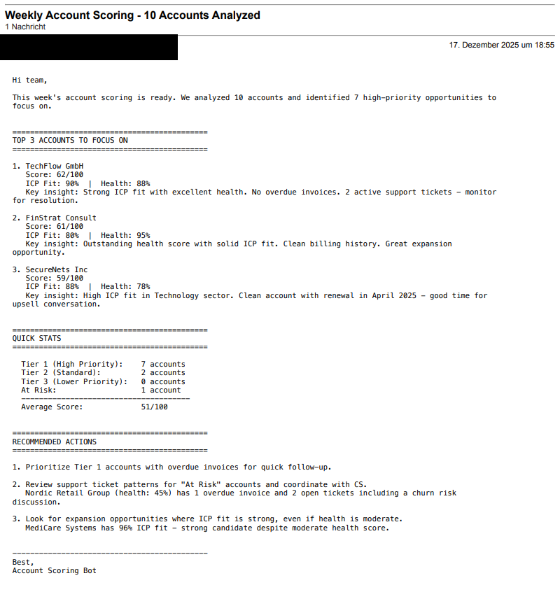

# LangDock Portfolio


> Automated Sales Reporting with LangDock – Workflow + Assistant saving 2h/week at $3.46 total cost.

## Use Case: Automated Sales Reporting

Before applying to LangDock, I wanted to know: Does the product fit my workflow?

So I got a **LangDock** subscription and built a sales reporting system – **deterministic workflow** for Monday reports plus **flexible ad-hoc analysis**.

**The most interesting part:** Understanding the practical difference between deterministic workflows and probabilistic assistants. Both use the same data foundation, but while the workflow guarantees structured outputs, the assistant interprets flexibly.

## What I Built

### Workflow: Weekly Sales Report

Deterministic. Every Monday 9:00 AM. Identical output for identical data.



> Detailed scoring weights and calculations (ICP, Health, Churn Risk) can be found in the [Scoring Documentation](./docs/SCORING.md).

<details>
<summary><strong>View LangDock Canvas</strong></summary>
<br>
<p align="center">
  
</p>
</details>

<details>
<summary><strong>View Email Output</strong></summary>
<br>



</details>

### Assistant: Sales Research

Probabilistic. User-initiated. Variable interpretation.

**Example questions:**

- "Top 3 accounts for this week?"
- "Who has churn risk?"
- "Pre-call briefing for TechFlow"

<details>
<summary><strong>View Chat Response</strong></summary>
<br>
<p align="center">
  
</p>
</details>

## Technical Implementation

The workflow uses a JavaScript Logic Node for fail-fast validation:

```javascript
// prepare-files.js - Validates files BEFORE expensive LLM call
const supportTicketsPath = getFileA.output.result.path;
const invoicesPath = getFileB.output.result.path;
const accountsPath = getFileC.output.result.path;

return {
  isValid: true,
  files: { supportTickets: supportTicketsPath, invoices: invoicesPath, accounts: accountsPath },
  message: `Files ready: ${supportTicketsPath}, ${invoicesPath}, ${accountsPath}`
};
```

> **Why this matters:** 80% of workflow costs occur in the Agent Node. This validation fails on data problems with $0 cost instead of full agent costs ($0.08-0.10).

[Full code with documentation](./langdock-files/Workflows/Weekly-Sales-Report/prepare-files.js)

📊 **[Detailed metrics & results →](./docs/JOURNEY.md)**

## Deterministic vs. Probabilistic

| Aspect | Workflow | Assistant |
|:-------|:---------|:----------|
| Trigger | Automated (Mon 9:00 AM) | User-initiated |
| Output | Identical for same data | Variable |
| Use Case | Weekly Reporting | Ad-hoc Deep-Dive |

**Further Documentation:** [Development Journey & Learnings](./docs/JOURNEY.md) • [Scoring Formula & Logic](./docs/SCORING.md) • [Assistants & Workflows](./langdock-files/)

## Contact

**Yunus Ishaq**

[](mailto:yunus@ishaq.de)
[](https://www.linkedin.com/in/yunusishaq/)

---

*DEZEMBER 2025*
