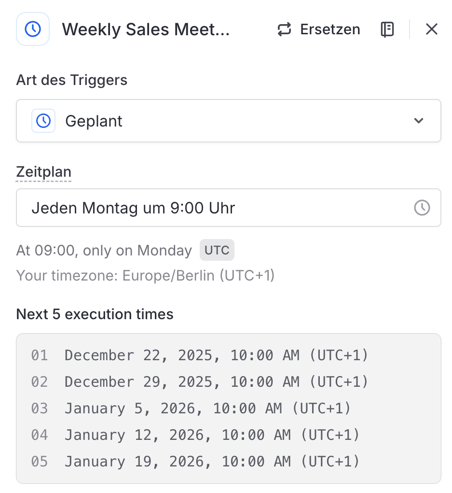

# Node 01: Weekly Sales Meeting Trigger

## Configuration

| Setting | Value |
|---------|-------|
| Type | Scheduled (Geplant) |
| Schedule | Jeden Montag um 9:00 Uhr |
| Time | 09:00 UTC |
| Timezone | Europe/Berlin (UTC+1) |
| Local Display | 10:00 AM |

## LangDock UI Settings

```
Art des Triggers: Geplant
Zeitplan: Jeden Montag um 9:00 Uhr
Time: At 09:00, only on Monday (UTC)
Your timezone: Europe/Berlin (UTC+1)
```

## Next 5 Execution Times

| # | Date & Time |
|---|-------------|
| 01 | December 22, 2025, 10:00 AM (UTC+1) |
| 02 | December 29, 2025, 10:00 AM (UTC+1) |
| 03 | January 5, 2026, 10:00 AM (UTC+1) |
| 04 | January 12, 2026, 10:00 AM (UTC+1) |
| 05 | January 19, 2026, 10:00 AM (UTC+1) |

## Purpose

Initiates the Weekly Sales Report workflow at the start of each business week, ensuring the Sales team receives their priority account report before the Monday standup.

## Notes

- Runs automatically every Monday
- No manual trigger option configured
- Holidays are not excluded
- If LangDock is unavailable at trigger time, the run is skipped (no retry)

## Screenshot


