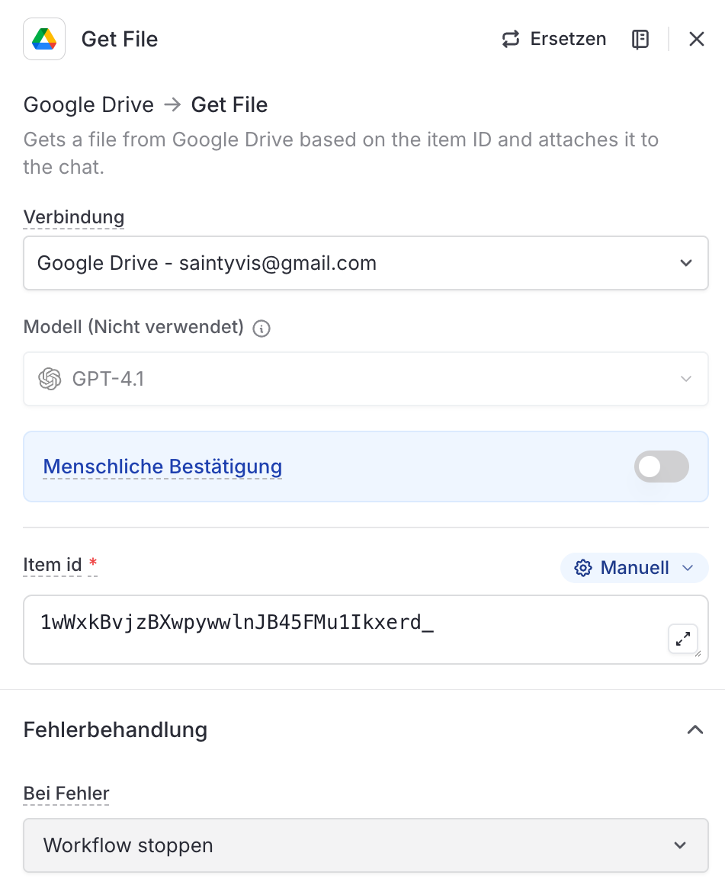

# Node 02b: Get File (Tickets)

## Configuration

| Setting | Value |
|---------|-------|
| Type | Google Drive → Get File |
| Connection | Google Drive - connected-user@example.com |
| Item ID | `1wWxkBvjzBXwpywwlnJB45FMu1Ikxerd_` |
| Output Variable | `getFileB` |
| Model | GPT-4.1 (not used) |
| Human Confirmation | OFF |
| Error Handling | Workflow stoppen |

## LangDock UI Settings

```
Google Drive → Get File
Gets a file from Google Drive based on the item ID and attaches it to the chat.

Verbindung: Google Drive - connected-user@example.com
Modell (Nicht verwendet): GPT-4.1
Menschliche Bestätigung: OFF
Item id: 1wWxkBvjzBXwpywwlnJB45FMu1Ikxerd_
Fehlerbehandlung - Bei Fehler: Workflow stoppen
```

## File Details

| Property | Value |
|----------|-------|
| File | `support-tickets-2024.csv` |
| Path | `data/support/tickets/support-tickets-2024.csv` |
| Records | 12 support tickets |
| Format | CSV with headers |

## Schema

| Column | Type | Description |
|--------|------|-------------|
| ticket_id | string | `TKT-XXX` format |
| account_id | string | `ACC-2024-XXX` reference |
| subject | string | Ticket title |
| status | enum | open, in_progress, resolved |
| priority | enum | low, medium, high, critical |
| created_at | date | ISO 8601 |
| resolved_at | date | ISO 8601 (nullable) |

## Used By

- **Node 03 (Prepare Files)**: Path passed as `supportTicketsPath`
- **Node 05 (Agent)**: Counts tickets per account for penalty calculation

## Screenshot


