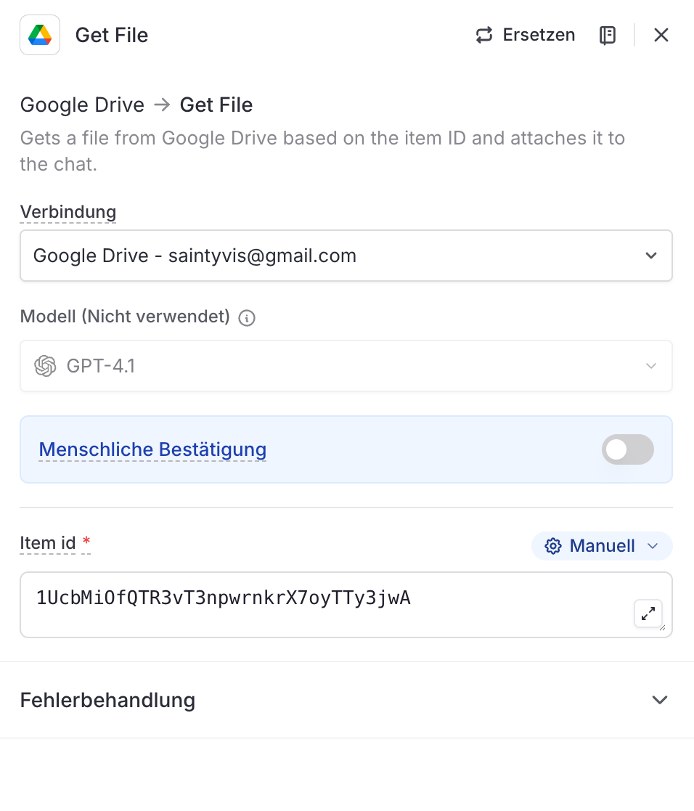

# Node 02c: Get File (Accounts)

## Configuration

| Setting | Value |
|---------|-------|
| Type | Google Drive → Get File |
| Connection | Google Drive - connected-user@example.com |
| Item ID | `1UcbMi0fQTR3vT3npwrnkrX7oyTTy3jwA` |
| Output Variable | `getFileC` |
| Model | GPT-4.1 (not used) |
| Human Confirmation | OFF |
| Error Handling | Workflow stoppen |

## LangDock UI Settings

```
Google Drive → Get File
Gets a file from Google Drive based on the item ID and attaches it to the chat.

Verbindung: Google Drive - connected-user@example.com
Modell (Nicht verwendet): GPT-4.1
Menschliche Bestätigung: OFF
Item id: 1UcbMi0fQTR3vT3npwrnkrX7oyTTy3jwA
Fehlerbehandlung - Bei Fehler: Workflow stoppen
```

## File Details

| Property | Value |
|----------|-------|
| File | `accounts.csv` |
| Path | `data/sales/accounts.csv` |
| Records | 10 customer accounts |
| Format | CSV with headers |

## Schema

| Column | Type | Description |
|--------|------|-------------|
| account_id | string | `ACC-2024-XXX` format |
| company_name | string | Customer company name |
| industry | string | Industry vertical |
| tier | enum | starter, professional, enterprise |
| mrr_eur | number | Monthly recurring revenue |
| health_score | number | 0-100, account health metric |
| icp_score | number | 0-100, ideal customer profile fit |
| renewal_date | date | Next renewal date |
| csm_email | string | Customer Success Manager |

## Used By

- **Node 03 (Prepare Files)**: Path passed as `accountsPath`
- **Node 05 (Agent)**: Primary data source for scoring

## Scoring Relevance

The `icp_score` and `health_score` columns are the primary inputs to the scoring formula:

```
Score = (ICP × 0.4) + (Health × 0.3) - penalties
```

## Screenshot


