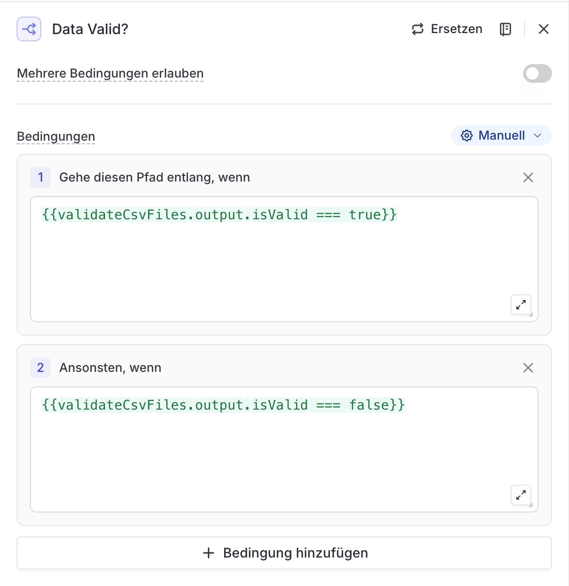

# Node 04: Data Valid?

## Configuration

| Setting | Value |
|---------|-------|
| Type | Condition |
| Multiple Conditions | OFF (Mehrere Bedingungen erlauben: OFF) |
| Input Variable | `validateCsvFiles` (from Node 03) |

## LangDock UI Settings

```
Bedingungen (Manuell):

1. Gehe diesen Pfad entlang, wenn:
   {{validateCsvFiles.output.isValid === true}}

2. Ansonsten, wenn:
   {{validateCsvFiles.output.isValid === false}}

+ Bedingung hinzufügen
```

## Condition Expressions

| # | Label | Expression | Routes To |
|---|-------|------------|-----------|
| 1 | Data Valid | `{{validateCsvFiles.output.isValid === true}}` | Node 05 (Analyze & Generate Report) |
| 2 | Data Invalid | `{{validateCsvFiles.output.isValid === false}}` | Node 04a (Alert: Invalid Data) |

## Purpose

Fail-fast validation before the expensive LLM Agent node. Prevents wasted API costs on invalid data.

## Why This Matters

From production experience (36 runs):
- LLM Agent nodes cause 85-95% of workflow costs
- Fail-fast validation saves ~$0.10 per failed run
- Catches data issues before expensive processing

## Connection

```
Node 03 (Prepare Files)
    │
    ▼
Node 04 (Data Valid?) ──┬── isValid === true  ──▶ Node 05 (Analyze & Generate Report)
                        │
                        └── isValid === false ──▶ Node 04a (Alert: Invalid Data)
```

## Screenshot


