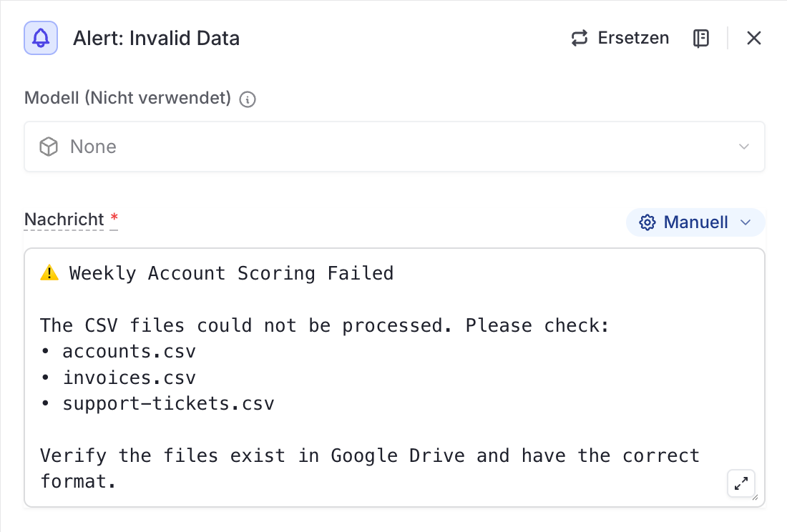

# Node 04a: Alert: Invalid Data

## Configuration

| Setting | Value |
|---------|-------|
| Type | Notification |
| Model | None (Nicht verwendet) |
| Trigger | Data Valid? → isValid === false branch |

## LangDock UI Settings

```
Modell (Nicht verwendet): None
Nachricht: [see message below]
```

## Alert Message

```
⚠ Weekly Account Scoring Failed

The CSV files could not be processed. Please check:
• accounts.csv
• invoices.csv
• support-tickets.csv

Verify the files exist in Google Drive and have the correct format.
```

## When This Node Executes

This node is triggered when the `Data Valid?` condition (node-04) evaluates to **false**, indicating:
- One or more CSV files failed to download
- CSV parsing returned empty or malformed data
- The `isValid` flag from Prepare Files is false

## Connection

```
Node 04 (Data Valid?)
    │
    ├── isValid === true  ──▶ Node 05 (Analyze & Generate Report)
    │
    └── isValid === false ──▶ Node 04a (Alert: Invalid Data) [THIS NODE]
                                    │
                                    └── Workflow ends
```

## Screenshot


