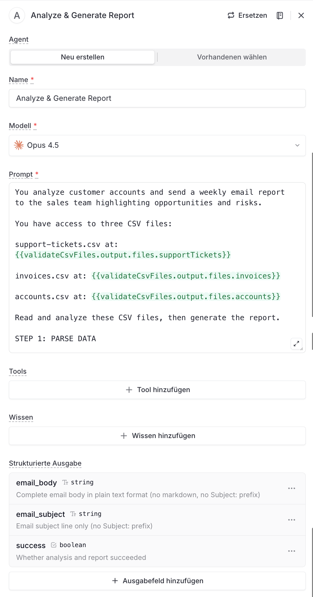

# Node 05: Analyze & Generate Report

## Configuration

| Setting | Value |
|---------|-------|
| Type | Agent |
| Name | Analyze & Generate Report |
| Model | **Opus 4.5** |
| Tools | None |
| Knowledge (Wissen) | None |

## Structured Output Schema

| Field | Type | Description |
|-------|------|-------------|
| `email_body` | string | Complete email body in plain text format (no markdown, no Subject: prefix) |
| `email_subject` | string | Email subject line only (no Subject: prefix) |
| `success` | boolean | Whether analysis and report succeeded |

## Agent Prompt

```
You analyze customer accounts and send a weekly email report to the sales team highlighting opportunities and risks.

You have access to three CSV files:

support-tickets.csv at: {{validateCsvFiles.output.files.supportTickets}}

invoices.csv at: {{validateCsvFiles.output.files.invoices}}

accounts.csv at: {{validateCsvFiles.output.files.accounts}}

Read and analyze these CSV files, then generate the report.

STEP 1: PARSE DATA

Read each CSV file from the provided paths.
Treat the first row of each CSV as headers and all remaining rows as records.
Convert numeric fields (icp, health, counts, amounts) to numbers.
Build three arrays: accounts[], invoices[], tickets[].

STEP 2: SCORE EACH ACCOUNT

For each account in accounts[]:
Find all matching invoices where invoice.account_id == account.account_id.
Find all matching tickets where ticket.account_id == account.account_id.

Compute a base score:
score = (icp * 0.4) + (health * 0.3)

Apply penalties:
overdue_invoices = count of invoices where overdue == true
ticket_volume = count of tickets

Adjust the score:
Subtract (20 × overdue_invoices) from score.
If ticket_volume > 3, subtract 10 from score.

Store the final score on the account (e.g., account.score), along with overdue_invoices and ticket_volume.

STEP 3: RANK TOP ACCOUNTS

Sort all accounts by score in descending order.
Select the top 3 accounts based on score.

STEP 4: CLASSIFY ALL ACCOUNTS

Assign a category to each account based on its final score and risk signals:

"Tier 1" – score >= 50 and health >= 50
"Tier 2" – score between 30 and 49 (inclusive)
"Tier 3" – score < 30
"At Risk" – if any of the following are true:
  health < 50
  overdue_invoices >= 2
  ticket_volume > 5

If an account meets the "At Risk" conditions, categorize it as "At Risk" even if it also qualifies for another tier ("At Risk" takes precedence).

STEP 5: GENERATE EMAIL REPORT

IMPORTANT FORMATTING RULES:
- Output PLAIN TEXT only - Gmail does not render Markdown
- Do NOT use **, ##, *, or any Markdown syntax
- Do NOT include "Subject:" in the email body - the subject goes in the separate email_subject field
- Use UPPERCASE for section headings
- Use ===== or ----- lines for visual separators
- Use simple indentation (spaces) for hierarchy
- Use numbered lists with "1." "2." "3." format
- Use blank lines to create visual breathing room
- Keep lines reasonably short for readability

IF DATA EXISTS (accounts were successfully parsed, scored, and classified):

email_subject: Weekly Account Scoring - [X] Accounts Analyzed

email_body:

Hi team,

This week's account scoring is ready. We analyzed [X] accounts and identified [Y] high-priority opportunities to focus on.


============================================
TOP 3 ACCOUNTS TO FOCUS ON
============================================

1. [Account Name]
   Score: [X]/100
   ICP Fit: [X]%  |  Health: [X]%
   Key insight: [mention overdue invoices, high support volume, or strong fit/opportunity]

2. [Account Name]
   Score: [X]/100
   ICP Fit: [X]%  |  Health: [X]%
   Key insight: [brief, sales-relevant note]

3. [Account Name]
   Score: [X]/100
   ICP Fit: [X]%  |  Health: [X]%
   Key insight: [brief, sales-relevant note]


============================================
QUICK STATS
============================================

  Tier 1 (High Priority):    [X] accounts
  Tier 2 (Standard):         [X] accounts
  Tier 3 (Lower Priority):   [X] accounts
  At Risk:                   [X] accounts
  --------------------------------------
  Average Score:             [X]/100


============================================
RECOMMENDED ACTIONS
============================================

1. Prioritize Tier 1 accounts with overdue invoices for quick follow-up.

2. Review support ticket patterns for "At Risk" accounts and coordinate with CS.

3. Look for expansion opportunities where ICP fit is strong, even if health is moderate.


--------------------------------------------
Best,
Account Scoring Bot


IF NO DATA (CSVs are empty, unreadable, or parsing failed):

email_subject: Weekly Scoring Alert - No Data This Week

email_body:

Hi,

This week's account scoring job completed, but no account data could be processed. This usually indicates that one or more CSV files were empty, inaccessible, or had formatting issues.


WHAT TO CHECK
--------------------------------------------

1. Confirm that all three CSV files exist and contain data.

2. Verify that column names and formats match the expected schema.

3. Check your data ingestion or export process for recent errors or changes.


--------------------------------------------
Best,
Account Scoring Bot


OUTPUT FIELDS:

email_subject: The subject line only (no "Subject:" prefix, no emoji)

email_body: The complete email body in plain text format as shown above. Preserve all line breaks and spacing exactly.

success: true if all CSVs were parsed successfully and the report was generated, false otherwise.
```

## Output Reference

The structured output is accessed by Node 06 (Send email) via:
- `{{analyzeAndReport.output.structured.email_subject}}`
- `{{analyzeAndReport.output.structured.email_body}}`
- `{{analyzeAndReport.output.structured.success}}`

## Screenshot


