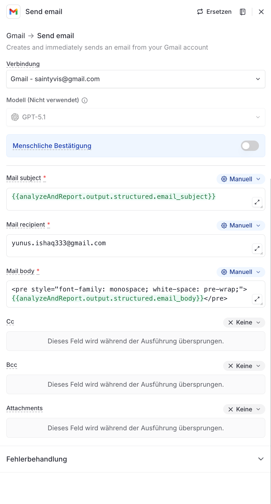

# Node 06: Send email

## Configuration

| Setting | Value |
|---------|-------|
| Type | Gmail → Send email |
| Connection | Gmail - connected-user@example.com |
| Model | GPT-5.1 (not used) |
| Human Confirmation | OFF |

## LangDock UI Settings

```
Gmail → Send email
Creates and immediately sends an email from your Gmail account

Verbindung: Gmail - connected-user@example.com
Modell (Nicht verwendet): GPT-5.1
Menschliche Bestätigung: OFF
```

## Email Configuration

| Field | Value |
|-------|-------|
| Mail subject | `{{analyzeAndReport.output.structured.email_subject}}` |
| Mail recipient | `sales-team@flowsync.de` |
| Mail body | `<pre style="font-family: monospace; white-space: pre-wrap;">{{analyzeAndReport.output.structured.email_body}}</pre>` |
| Cc | None (Keine) |
| Bcc | None (Keine) |
| Attachments | None (Keine) |

## Why `<pre>` Tag?

The email body uses a `<pre>` tag with monospace styling to preserve:
- Line breaks and spacing from the Agent's plain text output
- ASCII art separators (=====, -----)
- Indentation hierarchy

This ensures consistent rendering across Gmail, Outlook, and Apple Mail.

## Input Variables

All variables come from Node 05 (Analyze & Generate Report) structured output:
- `{{analyzeAndReport.output.structured.email_subject}}` - Dynamic subject line
- `{{analyzeAndReport.output.structured.email_body}}` - Full report content

## Error Handling

```
Fehlerbehandlung: [default]
```

## Screenshot


